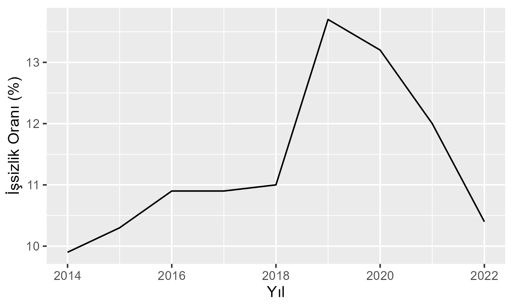
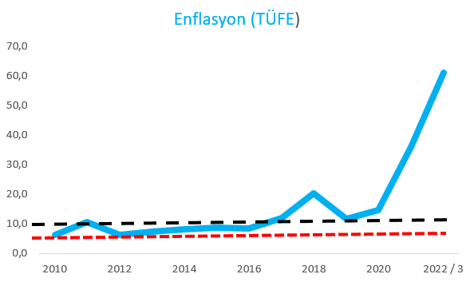

```{r setup, include=FALSE}
knitr::opts_chunk$set(cache = FALSE, echo = TRUE, message = FALSE, warning = FALSE)
```

<!-- ======================================================================= -->

<!-- ============================== NOTLAR ================================= -->

<!-- ======================================================================= -->

## Çalışmanın Amacı

Enflasyon ve işsizlik arasında teorik olarak ne tür bir ilişkinin olduğu
ve Türkiye örneği üzerinden incelenmesi

## Literatür

İşsizlik ile üretim düzeyi ve fiyat değişiklikleri arasındaki ilişkiler
geçmişten bugüne tartışılmaya devam etmektedir. Mill, Hume ve
Thornton'ın konuyla ilgili çalışmaları olmasına rağmen teorik izahdan
ileriye gidememişlerdir. *1926'da* **Irving Fisher** "İşsizlik ve Fiyat
Değişiklikleri Arasındaki İstatistiksel İlişki" başlıklı çalışmasında
fiyat değişiklikleri ile işsizlik arasındaki ilişkiyi istatistiksel
olarak analiz etmiştir. *1936* yılında **Tinbergen** bu konuda ilk
ekonometrik çalışmayı yapmış ve işsizlikten ücret enflasyonu yönüne bir
nedensellik ilişkisi tespit etmiştir. **A.J. Brown** ise ücret
enflasyonu ve işsizlik arasında yaptığı analizinde ilk istatistiki
dağılım diyagramını çizmiştir. **Paul Sultan** *1957'de* yaptığı
analizde, işsizlik oranı ile fiyat seviyesindeki yıllık değişme
arasındaki ödünleşme ilişkisini bir eğri yardımıyla belirlemiştir. Bütün
bu çalışmalara rağmen enflasyon - işsizlik ilişkisi **Phillips** ile
özdeşleşmiştir

Enflasyon oranını düşürmek maksadıyla gerçekleştirilen talep daraltıcı
para ve maliye politikaları işsizliğe neden olurken tam tersi işsizlik
oranını azaltmak için gerçekleştirilen talep genişletici para ve maliye
politikaları ise enflasyonu arttırmaktadır.

**Phillips**,işsizlik ile nominal ücretlerdeki değişme oranı arasında,
negatif ve lineer olmayan fakat dengeli bir ilişkinin bulunduğunu tespit
etmiştir ve işsizlik oranı *% 5,5* olunca nominal ücret artış oranının *% 0*
düzeyinde gerçekleştiğini ifade etmiştir **(Phillips, 1958: 290)**
**Phillips'in** bu analizi teorik temelden yoksun bir çalışma olarak
nitelendirilmiştir.**Robert Solow ve Paul Samuelson**, orijinal Phillps
eğrisini enflasyon ile işsizlik kavramı arasındaki ilişkiyi gösteren bir
eğriye dönüştürmüşlerdir. Bu iki iktisatçı, işsizlik haddinin *% 3'e*
düşmesi halinde, fiyat artış haddinin *% 4,5'e* çıktığını göstermişlerdir.
Bunun sonucunda, yüksek istihdam ve üretim çok daha fazla fiyat artışına
malolmaktadır **(Samuelson ve Solow, 1960:192-193)**. **Samuelson ve Solow**
Bununla birlikte işsizlik ve enflasyonun bu ödünleşme ilişkisinin sadece
kısa dönemde söz konusu olduğunu ve uzun dönemde bu ilişkinin
bozulduğunu belirtmişlerdir **(Özkök ve Polat, 2017:2)**

İşsizlik ve enflasyon ilişkisi çok uzun yıllardır tartışılmaktadır.
**Phillips**, *1958'de* yayınlanan ve *İngiltere'nin 1861- 1957 dönemini* ele
alan araştırmasında işsizlik haddi ile nominal ücretlerin değişim oranı
arasında negatif bir bağıntı gerçekleştiğini belirlemiştir. Ardından
**Samuelson ve Solow**, **Phillips'in** bu makalesinden hareketle *1960* yılında
yayınlanan çalışmalarında, işsizlik ve enflasyon arasında negatif bir
ilişki olduğunu ifade etmişler ve orijinal Phillips eğrisini
değiştirerek bu analizi geliştirmişlerdir. Bu analize göre, işsizliğin
ve enflasyonun aynı anda azalması imkansızdır. İşsizliği önlemek için
uygulanan politikalar enflasyonu arttırırken, enflasyonu azaltmak için
uygulanan politikalar ise işsizliği arttırmaktadır. @elife2020turkiye

Basit Phillips Eğrisine göre; işsizliği düşük seviyelerini sürekli bir
şekilde korumak, ancak enflasyonu yüksek seviyelerini tolere etmekle
mümkün olabilir Beklentilerle Güçlendirilmiş Phillips Eğrisi
yaklaşımında, orijinal Phillips Eğrisinden farklı olarak kısa ve uzun
dönem ayrımına gidilmiştir. Bu yeni yaklaşıma göre, Phillips Eğrisi kısa
dönemde negatif eğimlidir. Aynı zamanda kısa dönemde enflasyonla
işsizlik arasında değiş tokuş ilişkisi söz konusudur ve bu ilişki
beklenmeyen enflasyonla açıklanabilir. Ancak, uzun dönemde Phillips
Eğrisi yatay eksene dik bir doğru biçimindedir ve bu durum enflasyon ve
işsizlik arasında bir ödünleşme olmadığını ifade etmektedir.
@sancar2017enflasyon

Yapılan çalışmalarda işsizlikteki *%1'lik* artışın enflasyonda *%2.5'luk*
düşüşe neden olacağını ve bu kısa dönem dengesinin uzun vadede etkisini
yitireceği gözlemlenmiştir @dereli2019relationship

**Friedman-Phelps'e göre**, kısa vadeli enflasyon-işsizlik ödünleşimi,
halkın beklentisinin üstünde bir enflasyon artışı ile olabilir. Başka
bir deyişle, kısa vadede konvansiyonel Phillips'in varlığı, halkın
beklentilerini gerçek seviyeye uygun şekilde ayarlayamamasından
kaynaklanan gerçek ve beklenen enflasyon arasındaki uyumsuzluğa
bağlıdır. @karahan2012tradeoff

## Sonuç ve Türkiye Örneği Üzerine İnceleme

Bütün bu araştırmalardan çıkardığımız genel sonuç kısa vadede
enflasyonla işsizlik arasında negatif bir ilişkinin olduğu ve bu
ilişkinin nedensellik ilişkisi değil kolerasyon ilişkisi olduğunu
belirtebiliriz fakat Türkiye'deki durumu incelediğimizde bu kanının
işlemediğini hatta tam tersine işlediğini görebiliriz çünkü *2019'a*
kadar enflasyon artarken işsizlik de artmış ancak *2019'dan* sonra
enflasyon artarken işsizlik düşmeye başlamıştır.





\newpage

# Kaynakça {#references}

TÜİK, İşgücü İstatistikleri, 2014-2022

::: {#refs}
:::
